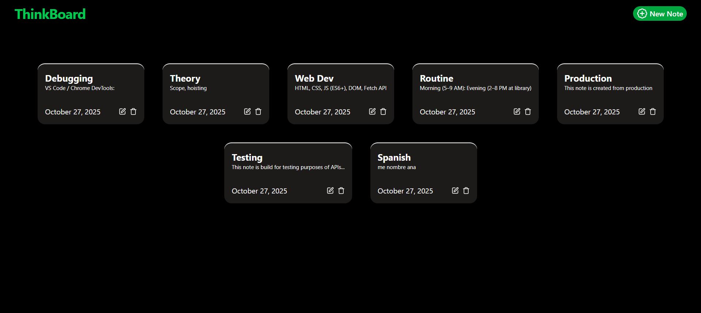
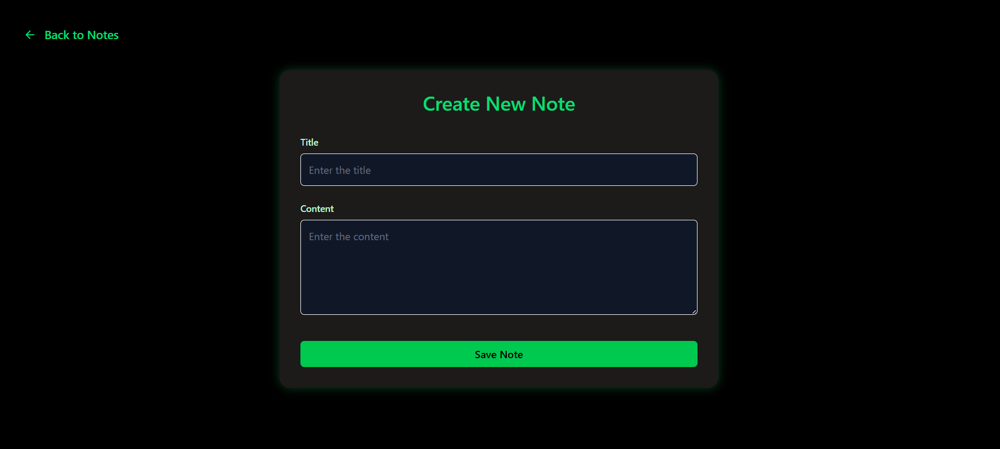
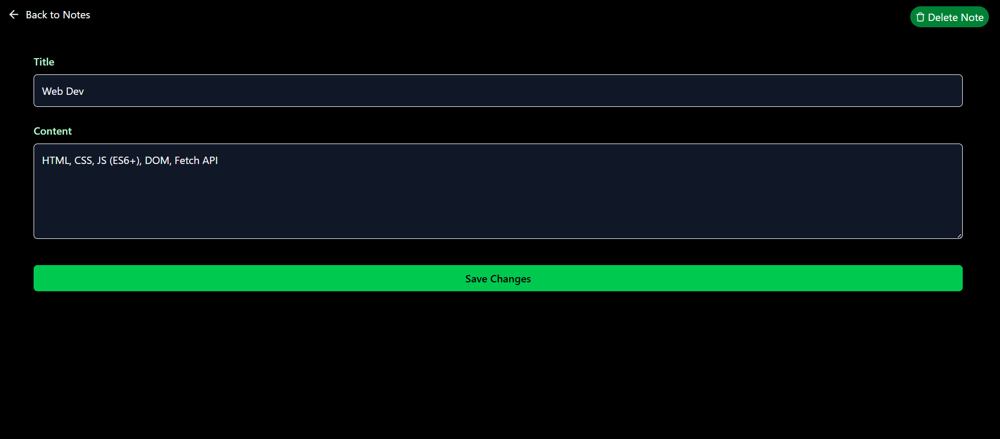
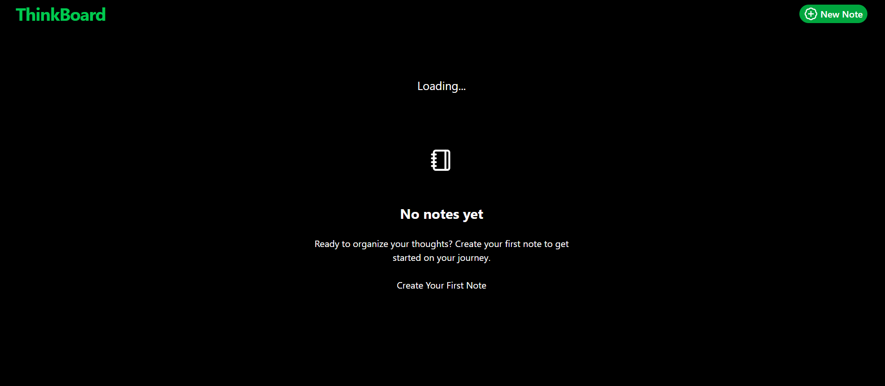

#  ThinkBoard

- A full-stack **MERN (MongoDB, Express, React, Node.js)** application that lets you **create, view, update, and delete notes** with a clean UI.  
- Built using **React.js**, **Tailwind CSS**, and **React-Toastify** for notifications.  
- Backend is powered by **Node.js**, **Express**, and **MongoDB (Mongoose)**.  
- Deployed on **Render**.

---

## 🚀 Live Demo  
🔗 [View ThinkBoard on Render](https://thinkboard-uf3o.onrender.com/)

---

##  Tech Stack

### **Frontend**
-  React.js  
-  Tailwind CSS  
-  React-Toastify  

### **Backend**
-  Node.js  
-  Express.js  
-  MongoDB with Mongoose ORM  

---

## 🌟 Features

**Create Notes** — Add a new note with title and content.  
 **Read Notes** — View all saved notes on the homepage.  
 **Update Notes** — Edit the title or content of existing notes.  
 **Delete Notes** — Instantly remove a note with a delete icon.  
 **Toast Notifications** — Success and error alerts for create, update, delete.  
 **Rate Limiting** — API is protected from overuse (rate-limit page displayed).  
 **Responsive UI** — Works seamlessly across devices.  
 **Real-Time Updates** — Instantly reflects changes on the frontend after CRUD actions.

---

## 📸 Screenshots

| Page | Description | Preview |
|------|--------------|----------|
| 🏠 **Homepage** | Displays all saved notes with “Create Note” button at the top. Each note has edit and delete icons. |  |
| 📝 **Create Note Page** | Add a new note by entering title and content, then click **Save Note**. |  |
| ✏️ **Update Note Page** | Update note title/content or delete it using provided buttons. |  |
| 📭 **Empty Notes Page** | Shown when there are no notes in the database. |  |

---

## 🧰 Installation & Setup (Run Locally)

Follow these steps to run the ThinkBoard app locally on your system 👇

---

###  Clone the Repository
```bash
# Clone this repository
git clone https://github.com/YOUR_GITHUB_USERNAME/ThinkBoard.git

# Move into the project directory
cd ThinkBoard
```

###   Setup
```bash
 npm run build
```

### Create a .env file inside /backend
```bash
PORT=8080
MONGO_URI=your_mongodb_connection_string
UPSTASH_REDIS_REST_URL="redis_rest_url"
UPSTASH_REDIS_REST_TOKEN="redis_rest_token"
NODE_ENV = production
```
### Run Backend
```bash
 npm run start
```

---

## Folder Structure
```bash
ThinkBoard/
│
├── backend/
|   ├── src/
│   │   ├── config/
│   │   ├── controllers/
│   │   ├── middlewares/
│   │   ├── models/
│   │   ├── routes/
│   │   ├── server.js
│   ├── .env
│   ├── package-lock.json
│   └── package.json
|
├── frontend/
│   ├── src/
│   │   ├── components/
|   |   ├── lib/
│   │   ├── pages/
│   │   ├── App.css
│   │   ├── index.css
│   │   ├── App.jsx
│   │   └── main.jsx
│   ├── eslint.config.js
│   ├── index.html
│   ├── package-lock.json
│   ├── package.json
│   └── vite.config.js
│
├── assets/
│   ├── homepage.png
│   ├── create-note.png
│   ├── update-note.png
│   ├── empty.png
│   └── rate-limit.png
├── .gitignore
└── package.json
```

## 🔔 Toast Notifications

 **Create Notes** — Note Created Successfully!          
 **Update Notes** — Note Updated Successfully!     
 **Delete Notes** — Note Deleted Successfully!   
 **Rate Limiting** — Too many requests. Please try again later.


 ## Learnings
 
- Practiced MERN CRUD operations end-to-end.
- Implemented API rate-limiting for backend security.
- Used React-Toastify for modern, user-friendly feedback.
- Improved understanding of frontend-backend data sync.
- Deployed full-stack app successfully on Render.
